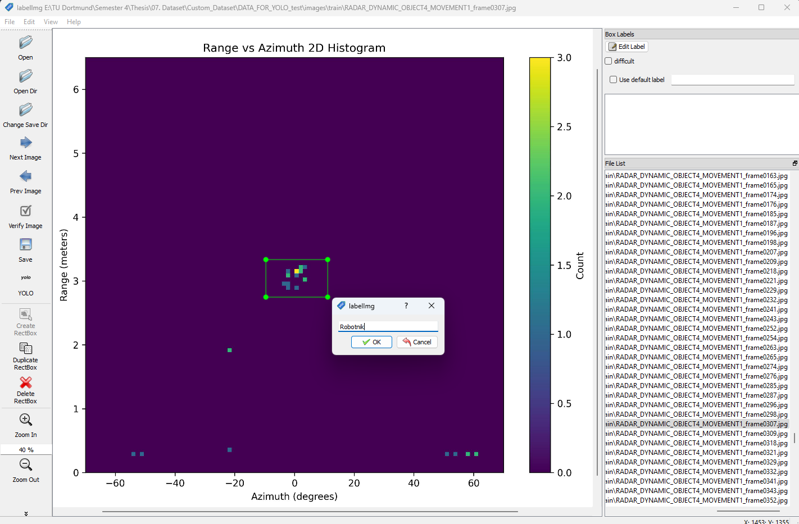
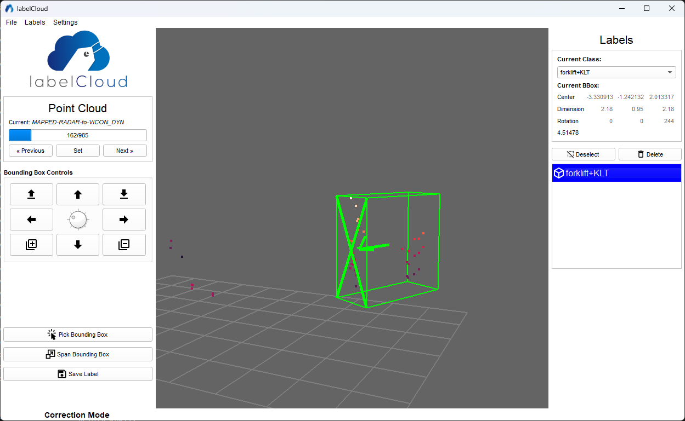
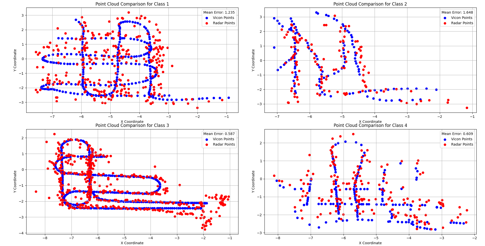

# Master Thesis: **Towards 6G-Driven Sensing: Development of Machine Learning-based Object Detection for Logistics Entities using mmWave Radar Sensor**


---

## 📄 Thesis Overview

This thesis investigates the potential of mmWave radar sensors for object detection in logistics environments, offering an alternative to traditional camera and LiDAR-based systems. These conventional systems suffer from drawbacks such as high costs, sensitivity to lighting and weather conditions, privacy concerns, and occlusion issues in complex warehouse environments.

To address these limitations, the study integrates the Texas Instruments **IWR6843ISK** mmWave radar sensor into a logistics setting and develops a machine learning-based object detection pipeline. Models such as **YOLOv7**, **Detectron2**, and **OpenPCDet** are trained and evaluated for detecting logistics entities like forklifts, mobile robots, and small load carriers (KLTs). The system is assessed for real-time performance in dynamic and cluttered environments, demonstrating the benefits of radar-based sensing—such as high resolution, environmental robustness, and reliable operation in low-visibility conditions.

This research contributes to the vision of 6G-driven smart logistics by offering a cost-effective, scalable, and privacy-preserving sensing alternative for industrial automation.

---

## 📚 Repository Index

1. [Sensor Integration](#01-sensor-integration)
2. [Data Collection](#02-data-collection)
3. [Preprocessing and Annotation](#03-preprocessing-and-annotation)
4. [Model Training & Evaluation](#04-model-training--evaluation)
5. [Real-Time Testing](#05-real-time-testing)
6. [Results & Analysis](#06-results--analysis)
7. [Future Work](#07-future-work)

---

## 01. Sensor Integration

This section outlines the integration of the mmWave radar sensor used for data collection. The sensors used are:

- **[IWR6843ISK](https://www.ti.com/tool/IWR6843ISK)**  
- **[MMWAVEICBOOST](https://www.ti.com/tool/MMWAVEICBOOST)**  
by Texas Instruments (TI).

---

### Flashing the Default Firmware

Begin by flashing the IWR6843ISK with TI's default firmware:  
🔗 **[Download from TI – mmWave SDK](https://www.ti.com/tool/MMWAVE-SDK)**

#### 🔧 S1 Switch Configuration for Flash Mode

| Mode          | S1.1 | S1.2 | S1.3 | S1.4 | S1.5 | S1.6 |
|---------------|------|------|------|------|------|------|
| Flash Mode    | On   | Off  | On   | On   | Off  | N/A  |

#### 💻 Flashing Steps (Using [UniFlash](https://www.ti.com/tool/UNIFLASH) on Windows)

1. Launch **UniFlash**.
2. In **New Configuration**, select your device and click **Start**.
3. Go to **Settings & Utilities**:
   - Set the COM port of the **CFG Port**.
4. Go to the **Program** tab:
   - Click **Browse** under *Meta Image 1* and select the `.bin` file.
5. Toggle the **NRST** switch to power cycle the board.
6. Click **Load Image** to flash.

> ✅ Firmware is now successfully flashed.

---

### 🧰 Hardware Setup

Refer to the image for physical connection and jumper setup:  
<p align="center">
  
</p>

---

#### 🔄 Switch Configuration for MMWAVEICBOOST Mode

| Mode                 | S1.1 | S1.2 | S1.3 | S1.4 | S1.5 | S1.6 |
|----------------------|------|------|------|------|------|------|
| MMWAVEICBOOST Mode   | Off  | Off  | Off  | Off  | On   | —    |

---

### 🚀 Running the Radar Sensor

1. Use the provided configuration file:  
   [`xwr68xx_profile_2.cfg`](./01.%20Sensor%20Integration/mmwave_radar_read/config/xwr68xx_profile_2.cfg)

2. Run the following command to start data capture:

   ```bash
   cd 01_SensorIntegration
   python py_mmw_main.py

3.  Captured Output Data
   - Saved in: `01_SensorIntegration/log/` as `.txt` files
   - Contains per timestamp:
      - Number of points detected
      - Range, azimuth, elevation
      - x,y,z coordinates
      - Velocity (v)
      - Range profile and SNR

## 02. Data Collection

The datasets used in this project include both raw and arranged data, which have been made publicly available on Kaggle.

- **Kaggle Repository – Arranged Dataset:**  
  [https://www.kaggle.com/mmwave-radar-dataset](https://kaggle.com/datasets/a5860c7266e6d1191bf4a4aa9ae23b057b86e63d9d10982285d128fb0957a796)

- **Kaggle Repository – Raw Dataset:**  
  [https://www.kaggle.com/mmwave-radar-dataset-raw](https://kaggle.com/datasets/f7de6334ad0bf5c2c828f40989f076e88b08063e22bbbd680a722276482816fc)

## 03. Preprocessing and Annotation

### 3.1 Range-Azimuth Dataset Creation
To convert collected raw log files into range-azimuth 2D histogram frames, execute the following command:
```bash
cd 02_DataPreprocessing/Yolov7/
python3 Gen-Range-Azimuth-2D-Histogram.py
```

#### Annotation Process
Use [LabelImg](https://github.com/HumanSignal/labelImg) for annotation:
   - Load images
   - Draw bounding boxes
   - Save annotations in YOLOv7 format

This process generates labels in YOLOv7 format.

<p align="center">
  
</p>

#### Dataset Directory Structure

#### For YOLOv7:
Organize the dataset in the following structure for train/test/validation splits:
```
-images/
   ├── test/
   │   ├── frame0001.jpg
   │   └── ...
   ├── train/
   │   ├── frame0100.jpg
   │   └── ...
   └── val/
       ├── frame0150.jpg
       └── ...
-labels/
   ├── test/
   │   ├── frame0001.txt
   │   └── ...
   ├── train/
   │   ├── frame0100.txt
   │   └── ...
   └── val/
       ├── frame0150.txt
       └── ...
```
**Label Format:**  
`<class_id> <x_center> <y_center> <width> <height>`

#### For Detectron2:
Organize the dataset as follows:
```
-images/
   ├── train/
   │   ├── annotations.coco.json
   │   ├── frame0001.jpg
   │   └── ...
   └── test/
       ├── annotations.coco.json
       ├── frame0100.jpg
       └── ...
```

To convert YOLO annotations to COCO format for Detectron2, run:
```bash
cd 02_DataPreprocessing/Detectron2/
python3 yolo_to_coco.py
```

### 3.2 3D Point Cloud Dataset Creation

To convert collected raw log files into 3D point cloud frames, execute the following command. This will generate the dataset in `.pcd` format, which is required for the annotation software LabelCloud:
```bash
cd 02_DataPreprocessing/OpenPCdet/
python3 txt_to_pcd.py
```
#### Annotation Process

Use [LabelCloud](https://github.com/ch-sa/labelCloud) for annotation:

- Load converted `.pcd` frames  
- Draw bounding boxes  
- Save annotations in `.txt` format

<p align="center">
  
</p>

#### Dataset Format for OpenPCDet

After annotation is complete, convert the `.pcd` format dataset to `.npy` format, as the model requires data in `.npy` format. Use the following command:
```bash
cd 02_DataPreprocessing/OpenPCdet/
python3 pcd_to_npy.py
```

Once the conversion is done, organize the dataset as follows:
```
-images/
   ├── imageSets/
   │   ├── train.txt
   │   └── val.txt
   ├── points/
   │   ├── 00001.npy
   │   ├── 00002.npy
   │   └── ...
   └── labels/
       ├── 00001.txt
       ├── 00002.txt
       └── ...
```
- `imageSets/` contains text files (`train.txt`, `val.txt`) listing the frame numbers for training and validation splits.

- `points/` contains the point cloud data in `.npy` format.

- `labels/` contains annotation files in `.txt` format.

**Label Format:**  
`x y z dx dy dz heading class_name`


## 04. Model Training & Evaluation

### 4.1 [YOLOv7](https://github.com/WongKinYiu/yolov7) Model Training

#### Dataset Preparation
After arranging the dataset, move the dataset folders to the following directories:

- `images` → `03_ModelTraining/Yolov7/images`
- `labels` → `03_ModelTraining/Yolov7/labels`

#### Generate Dataset Paths
Run the following commands to create `train.txt`, `test.txt`, and `val.txt`, which contain the paths to all dataset images:

```bash
cd 03_ModelTraining/Yolov7
python3 save_image_path.py
```

#### Configuration Settings

1. Write the class names in the `classes.txt` file.

2. Open and edit `03_ModelTraining/Yolov7/yolov7/cfg/training/custom_yolov7.yaml`:

    - Update the number of classes (`nc`) according to your dataset:
    
    ```yaml
    nc: 4  # number of classes
    ```

3. Open and edit `03_ModelTraining/Yolov7/yolov7/data/custom.yaml` to set dataset paths and class names:

    ```yaml
    train: /path/to/train.txt
    val: /path/to/val.txt
    test: /path/to/test.txt

    nc: 4  # number of classes

    names: ['Forklift+KLT', 'Robotnik', 'Forklift', 'Workstation']
    ```

#### Training the Model

Run the following command to train the YOLOv7 model:

```bash
python train.py --batch 16 --cfg 03_ModelTraining/Yolov7/yolov7/cfg/training/custom_yolov7.yaml --epochs 1000 --data 03_ModelTraining/Yolov7/yolov7/data/custom.yaml --weights yolov7.pt --device 0
```
#### Model Evaluation

After training, evaluate the model using this command:

```bash
python detect.py --weights 03_ModelTraining/Yolov7/yolov7/runs/train/exp/weights/best.pt --source 03_ModelTraining/Yolov7/images/test
```
#### Trained Model and Outputs

The trained model and outputs can be found in the following directory: `03_ModelTraining/Yolov7/yolov7/runs`

#### Additional: Automated Labeling

You can use the trained model for automated labeling using the following command:

```bash
python detect.py --weights 03_ModelTraining/Yolov7/yolov7/runs/train/exp/weights/best.pt --source /path/to/images --save-txt --project labels --name run --exist-ok
```
This will generate label `.txt` files for the given images and save them under the `labels/run` directory.

### 4.2 [Detectron2](https://github.com/facebookresearch/detectron2) Model Training
#### Dataset Preparation
Move the dataset folders to the following directories:`03_ModelTraining/Detectron2/images`

#### Training and Evaluation of the Model

To train the Detectron2 model, run the live script located at: `03_ModelTraining/Detectron2/script.ipynb`

This notebook allows you to modify the backbone architecture for training. In this project, both **RetinaNet** and **Faster R-CNN** were used as backbone models.

#### Trained Model and Outputs
The trained model and output files can be found in the following directory: `03_ModelTraining/Detectron2/output`

### 4.3 [OpenPCdet](https://github.com/open-mmlab/OpenPCDet) Model Training

#### Dataset Preparation
Move your dataset folders to the following directory:`03_ModelTraining/OpenPCDet/data/custom`

#### Installation the Model

Ensure that the correct CUDA version and NVIDIA drivers are installed on your system.

Install the OpenPCDet model using the following commands:

```bash
cd 03_ModelTraining/OpenPCDet
python3 python3 setup.py
```
#### Configuration Settings

Point Cloud Features:

Modify the following configurations in `custom_dataset.yaml` to match your point cloud features:

```yaml
POINT_FEATURE_ENCODING: {
    encoding_type: absolute_coordinates_encoding,
    used_feature_list: ['x', 'y', 'z', 'intensity'],
    src_feature_list: ['x', 'y', 'z', 'intensity'],
}

# In gt_sampling data augmentation
NUM_POINT_FEATURES: 4
```

Point Cloud Range and Voxel Sizes:

For voxel-based detectors such as **SECOND**, **PV-RCNN**, and **CenterPoint**:

- The point cloud range along the **z-axis divided by voxel size** should equal **40**.
- The point cloud range along the **x & y-axis divided by voxel size** should be a **multiple of 16**.

> **Note:** This rule also applies to pillar-based detectors such as **PointPillar** and **CenterPoint-Pillar**.

Category Names and Anchor Sizes:

Adapt category names and anchor sizes to your custom dataset in `custom_dataset.yaml`:

```yaml
CLASS_NAMES: ['Vehicle', 'Pedestrian', 'Cyclist']

MAP_CLASS_TO_KITTI: {
    'Vehicle': 'Car',
    'Pedestrian': 'Pedestrian',
    'Cyclist': 'Cyclist',
}

anchor_sizes: [[3.9, 1.6, 1.56]]

PREPARE: {
    filter_by_min_points: ['Vehicle:5', 'Pedestrian:5', 'Cyclist:5'],
    filter_by_difficulty: [-1],
}

SAMPLE_GROUPS: ['Vehicle:20', 'Pedestrian:15', 'Cyclist:15']
```
Create Data Info:

Modify `custom_dataset.py` for creating data infos:

```python
create_custom_infos(
    dataset_cfg=dataset_cfg,
    class_names=['Vehicle', 'Pedestrian', 'Cyclist'],
    data_path=ROOT_DIR / 'data' / 'custom',
    save_path=ROOT_DIR / 'data' / 'custom',
)
```
Generate the data info files by running:
```bash
   python -m pcdet.datasets.custom.custom_dataset create_custom_infos tools/cfgs/dataset_configs/custom_dataset.yaml
```

#### Training and Evaluation of the Model

Train the OpenPCDet model with the following command:

```bash
   cd 03_ModelTraining/OpenPCDet
   python -m pcdet.train --cfg_file cfgs/kitti_models/pv_rcnn.yaml
```

The following utility scripts are available for evaluation and visualization:
- Generate F1 Curve, PR Curve, and Confusion Matrix: `03_ModelTraining/OpenPCDet/gen_PR_F1_curve_CF_matrix.py`
- Generate prediction images: `03_ModelTraining/OpenPCDet/gen_vis_prediction.py` 
- Create a video from prediction images: `03_ModelTraining/OpenPCDet/gen_vis_prediction_video.py`

## 05. Real-Time Testing
For real time testing, run the sensor integration script and then run the following command to check the real time detection:

```bash
cd 03_ModelTraining/Yolov7/yolov7
python3 online_model_test.py
```
Here is the small video of online testing:


## 06. Results & Analysis

Here is the result for the range-azimuth 2D histogram dataset using the Yolov7 trained model:


Here is the result of the 3D point cloud dataset using the OpenPCDet model:


This result is compared with the benchmarked detection system (Vicon), and here is the comparison graph of it:



## 07. Future Work
This study focuses on object detection for indoor logistics using mmWave radar sensors, leveraging range-azimuth and 3D point cloud data. Future improvements include integrating additional sensor outputs like velocity and SNR through parallel models, expanding coverage with multiple sensors and stitching algorithms, and using higher-resolution industrial-grade radars for denser point clouds enabling object segmentation. Applications extend to real-time object avoidance on mobile robots, aerial monitoring with drones, and collaborative robotics, aiming to develop more accurate and versatile sensing systems for indoor logistics and beyond.

## Project Information

```bash
University:  
Technical University Dortmund (Technische Universität Dortmund)  
Faculty of Mechanical Engineering  
Chair of Material Handling and Warehousing  

Thesis Title: 
Towards 6G-Driven Sensing: Development of Machine Learning-based Radar Object Detection for Logistics Entities  

Degree Program:  
Master of Science in Automation and Robotics  

Presented by:  
Sahil Sanjay Rajpurkar    

Supervisors: 
- First Examiner: Prof.’in Dr.-Ing. Alice Kirchheim  
- Second Examiner: Irfan Fachrudin Priyanta, M.Sc.   

Place of Submission: Dortmund, Germany  
```
---

© 2025 Sahil Sanjay Rajpurkar.  
This repository is intended solely for academic and study purposes. Commercial use is not permitted.